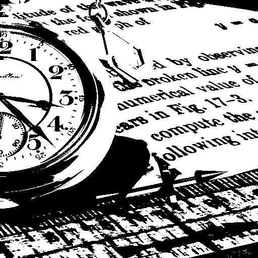

# Image binarization

This project provides an implementation of Otsu binarization.




## Table of Contents

- [Features](#features)
- [Requirements](#requirements)
- [Installation](#installation)
- [Usage](#usage)
- [Project Structure](#project-structure)

## Features

- **Processing an image to obtain binarized image**

## Requirements

- Python 3.x
- [opencv-python](https://pypi.org/project/opencv-python/)
- [NumPy](https://numpy.org/doc/2.2/index.html)

## Installation

1. **Clone the repository:**
   ```bash
   git clone https://github.com/MaciejPJ/Image-binarization
2. **Create and activate a virtual environment - optional but recommended**
3. **Install the required libraries (requirements.txt)**
   ```bash
   pip install -r requirements.txt

## Usage

1. **Place your image in the folder and change code inside ***main.py*** to suit your case.**

Run the application using the following command:
```bash
python main.py
```
Once launched, the application window will display your image after binarization.

## Project structure

- **requirements.txt** – Contains a list of required packages.
- **otsu.py** – Implementation of binarization using Otsu algorithm.
- **main.py** - The file to load your image and display the results.
- **test_image.bmp** – A test image to test the code.
- **binary_image.bmp** – A test image after binarization.

